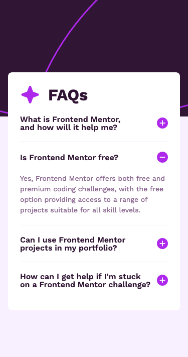

# Frontend Mentor - FAQ accordion solution

This is a solution to the [FAQ accordion challenge on Frontend Mentor](https://www.frontendmentor.io/challenges/faq-accordion-wyfFdeBwBz). Frontend Mentor challenges help you improve your coding skills by building realistic projects. 

## Table of contents

- [Overview](#overview)
  - [The challenge](#the-challenge)
  - [Screenshot](#screenshot)
  - [Links](#links)
- [My process](#my-process)
  - [Built with](#built-with)
  - [What I learned](#what-i-learned)
  - [Continued development](#continued-development)
  - [Useful resources](#useful-resources)
- [Author](#author)
- [Acknowledgments](#acknowledgments)

## Overview

### The challenge

Users should be able to:

- Hide/Show the answer to a question when the question is clicked
- Navigate the questions and hide/show answers using keyboard navigation alone
- View the optimal layout for the interface depending on their device's screen size
- See hover and focus states for all interactive elements on the page

### Screenshot

### Links

- Solution URL: [Github](https://github.com/graficdoctor/fe-24-009-faq-accordion)
- Live Site URL: [Netlify](https://velvety-fox-b8ed78.netlify.app/)

## My process

### Built with

- Semantic HTML5 markup
- CSS custom properties
- Flexbox
- CSS Grid
- Mobile-first workflow
- [React](https://reactjs.org/) - JS library

### What I learned

I'd just learned how to do an accordion using React and I wanted to see how much of it I could use in another, similar project. 

### Continued development

I bounced on certain issues I need to figure out:
- on hover effect on the title & how to make the title clickable
- add in A11y
- change background-color in icons/components from other libraries

## Author

- Website - [Katrien S](https://www.katriens.be)
- Frontend Mentor - [@graficdoctor](https://www.frontendmentor.io/profile/graficdoctor)
- Twitter - [@graficdoctor](https://www.twitter.com/graficdoctor)

## Acknowledgments

I solved this solution based on the code provided by John Smilga in his [Complete React, Next.js & TypeScript Projects Course 2024](https://www.udemy.com/course/react-tutorial-and-projects-course/?referralCode=FEE6A921AF07E2563CEF&couponCode=ST4MT73124) on Udemy.
